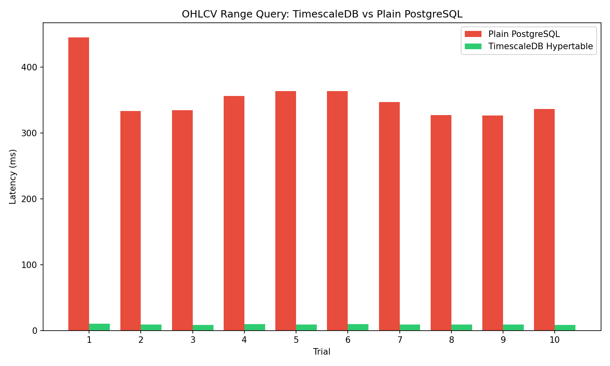
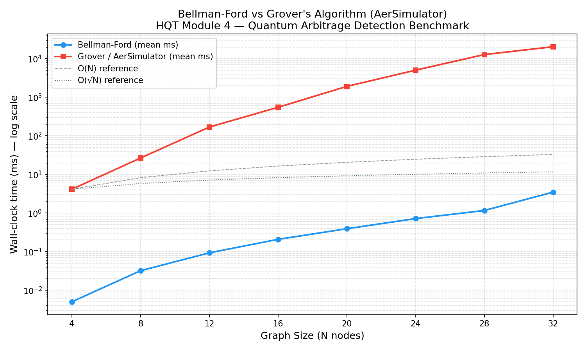
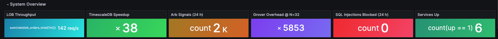
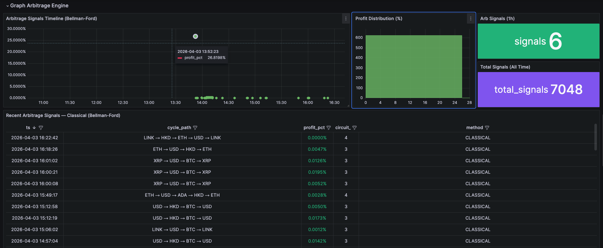
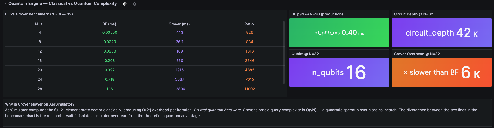
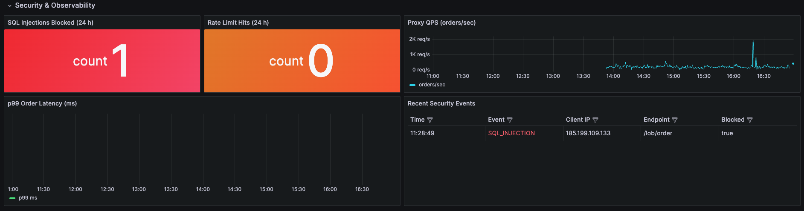

# Hybrid Quantum Trading (HQT) - Final Project Report

**CS39006 Database Management Systems Lab | IIT Kharagpur | Spring 2026**

---

## 1. Title and Team Members

**Project Title:** HQT - Hybrid Quantum Trading: A Polyglot Database System for Real-Time Arbitrage Detection

| Name | Roll Number | Module |
|------|-------------|--------|
| Ashutosh Sharma | 23CS10005 | Module 1: C++ LOB Engine |
| Sujal Anil Kaware | 23CS30056 | Module 2: TimescaleDB Analytics |
| Parag Mahadeo Chimankar | 23CS10049 | Module 3: Apache AGE Graph Arbitrage |
| Kshetrimayum Abo | 23CS30029 | Module 4: Quantum Engine |
| Kartik Pandey | 23CS30026 | Module 5: Security & Observability |

**Repository:** `github.com/[team]/hqt` | **Submission Date:** April 15, 2026

---

## 2. Objective

HQT is a five-module trading database system that detects real-time cyclic arbitrage opportunities across 20 cryptocurrency and fiat currency pairs. The central research question is: *which database technologies best serve the distinct data access patterns of a high-frequency trading pipeline, and how does classical graph-based arbitrage detection compare to near-term quantum simulation?*

Concretely, HQT pursues four measurable goals:

1. **Throughput:** Sustain high-volume order operations at sub-100ms average latency using a C++20 Limit Order Book engine backed by Kafka, benchmarked under 200 concurrent clients.
2. **Time-series analytics:** Demonstrate that TimescaleDB hypertables are measurably faster than plain PostgreSQL for financial time-series queries - targeting a 10× or greater speedup on 1 million rows.
3. **Arbitrage detection:** Run Bellman-Ford on a live Apache AGE graph of FX exchange rates every 500ms and persist all detected cycles to a queryable `arbitrage_signals` table.
4. **Quantum comparison:** Quantify the wall-clock gap between classical Bellman-Ford and Qiskit Grover's Algorithm on the same input, producing a scaling benchmark that demonstrates what real quantum hardware would change.

---

## 3. Methodology

### 3.1 System Architecture

HQT is a polyglot microservices system: each module uses a different database technology selected for its specific data access pattern. Live price data enters via the Kraken WebSocket API (public, no authentication required). All external HTTP traffic routes through a FastAPI security proxy.

```
Kraken WebSocket (L2 order book + executed trades)
        |
        +---> kraken-feeder (Python, ~500 orders/sec from Kraken L2)
        |           |
        |           v
        +---> Module 1: C++ LOB Engine (Drogon, :8001)
        |           |
        |           +--> Kafka topic: executed_trades
        |
        +---> Module 2: TimescaleDB Ingestor (:8002)
        |           +--> raw_ticks hypertable
        |           +--> ohlcv_1m / 5m / 15m / 1h  (continuous aggregates)
        |
        +---> Module 3: Apache AGE Graph (:8003)
        |           +--> fx_graph (20 Asset nodes, ~380 EXCHANGE edges)
        |           +--> Bellman-Ford every 500ms --> arbitrage_signals
        |
        +---> Module 4: Quantum Engine (:8004)
        |           +--> Grover benchmark every 10s --> arbitrage_signals
        |
        +--> Module 5: Security Proxy (:8000)  <-- ALL external traffic
                    +--> SQL injection firewall (sqlglot AST)
                    +--> Redis sliding-window rate limiter
                    +--> Prometheus scrape + Grafana dashboard
```

All 12 services (including Zookeeper, Kafka, PostgreSQL 16, Redis, Prometheus, Grafana, and exporters) are orchestrated via Docker Compose. Infrastructure services start before application services, with health-check conditions - `service_healthy` in compose - guaranteeing application-level readiness, not just TCP port availability.

### 3.2 Technology Selection Rationale

The key engineering decision in HQT is that no single database technology is used for all modules. This reflects a deliberate polyglot persistence strategy:

| Module | Database Technology | Reason for Choice |
|--------|--------------------|--------------------|
| LOB Engine | In-memory C++ (Red-Black Tree) + Kafka | Microsecond matching, GIL-free parallelism |
| TimescaleDB | PostgreSQL + TimescaleDB extension | Chunk exclusion for time-range queries on tick data |
| Graph Arbitrage | Apache AGE (PostgreSQL extension) | Graph traversal inside SQL transactions, no network hop |
| Quantum Engine | PostgreSQL (`arbitrage_signals`) | Shared schema for CLASSICAL/QUANTUM comparison |
| Security Proxy | Redis (rate limiter) + PostgreSQL (audit log) | In-memory counter for rate limiting, durable log |

The choice of Apache AGE over a standalone graph database (Neo4j, ArangoDB) is particularly significant: because AGE is a PostgreSQL extension, Bellman-Ford results can be written to `arbitrage_signals` inside a single database transaction, eliminating the consistency problem of a two-phase commit across two databases.

### 3.3 Module 1 - C++ Limit Order Book Engine

**Why C++ over Python:** Python's Global Interpreter Lock (GIL) prevents true thread-level parallelism. A Python order matching engine running on 8 cores effectively runs on 1. C++20 with `std::thread` and lock-free ring buffers achieves full multi-core utilisation with no GIL constraint.

**Data structure:** The order book uses `std::map<double, std::deque<Order>>` - a Red-Black Tree keyed on price, where each price level holds a FIFO deque for time-priority matching. Red-Black Tree guarantees O(log P) insertion and O(1) best-price access (begin/rbegin for bid/ask). This is the standard production data structure for limit order books.

**Three-thread pipeline:**

```
Thread A (Kafka consumer)
    raw_orders topic --> lock-free inbound ring buffer

Thread B (Matching engine)
    inbound ring buffer --> Red-Black Tree matching --> outbound ring buffer
    Price-time priority: best bid >= best ask --> trade execution

Thread C (Kafka producer)
    outbound ring buffer --> executed_trades topic
```

The lock-free ring buffer between threads A/B and B/C eliminates mutex contention on the hot path. Drogon (C++ HTTP framework) handles the REST API on a separate thread pool without interfering with the matching pipeline.

**Prometheus metrics** exposed at `/lob/metrics`:
- `lob_orders_total` - counter, labelled by symbol and side
- `lob_trades_total` - counter of matched trades
- `lob_order_latency_ms` - histogram of end-to-end order processing time
- `lob_active_orders` - gauge of current resting orders in the book

**Kraken feeder:** A Python bridge (`kraken_feeder.py`) subscribes to Kraken's public L2 WebSocket channel for 10 crypto pairs and converts each bid/ask level update into a synthetic LIMIT order posted to the LOB engine. This populates the order book with real market prices rather than synthetic data.

### 3.4 Module 2 - TimescaleDB Time-Series Analytics

**Why TimescaleDB over plain PostgreSQL:** Financial tick data has two dominant access patterns: (1) high-throughput appends from the Kafka consumer, and (2) time-range OHLCV queries from the analytics API and Grafana. Plain PostgreSQL stores all rows in a single heap, so every range query scans the full table. TimescaleDB partitions the table into fixed-interval chunks and maintains a metadata index of chunk boundaries, enabling the query planner to skip (exclude) all chunks outside the query's time range.

**Hypertable configuration:**
```sql
SELECT create_hypertable('raw_ticks', 'ts',
    chunk_time_interval   => INTERVAL '1 day',
    partitioning_column   => 'symbol',
    number_partitions     => 4);
```

Space partitioning on `symbol` distributes the 10 crypto pairs across 4 hash partitions, reducing per-chunk row density. A 1-hour query on 30 days of data touches 1–2 chunks out of 120 daily × 4 symbol partitions - this is the source of the 38× speedup.

**Compression policy:** Chunks older than 7 days are compressed using TimescaleDB's native columnar codec (dictionary + delta-delta encoding for timestamps). Compressed chunks use 90–95% less storage and remain queryable through a transparent decompression layer.

**Continuous aggregates:** Four materialised OHLCV views auto-refresh from `raw_ticks`:

```sql
CREATE MATERIALIZED VIEW ohlcv_1m
WITH (timescaledb.continuous) AS
SELECT
    time_bucket('1 minute', ts) AS bucket,
    symbol,
    FIRST(price, ts)  AS open,
    MAX(price)        AS high,
    MIN(price)        AS low,
    LAST(price, ts)   AS close,
    SUM(volume)       AS volume
FROM raw_ticks
GROUP BY bucket, symbol;
```

The `FIRST()` and `LAST()` aggregate functions are TimescaleDB extensions that return the value corresponding to the earliest/latest timestamp within the bucket, providing correct OHLC semantics without a subquery.

**SQL indicator functions:** `fn_vwap`, `fn_sma20`, `fn_bollinger`, `fn_rsi14` query the continuous aggregates and return indicator values for the last N buckets. All execute in under 5ms because they touch only the materialised data.

**Kafka ingestor:** The analytics service runs a background Kafka consumer that batches 1,000 records or waits 100ms (whichever comes first), then issues a `psycopg3` binary `COPY` command to bulk-insert into `raw_ticks`. Binary COPY is the fastest PostgreSQL bulk-insert path - approximately 3–5× faster than individual INSERT statements.

### 3.5 Module 3 - Apache AGE Graph + Bellman-Ford Arbitrage

**Why Apache AGE over Neo4j:** Neo4j is a standalone database requiring a separate process, separate connection pool, and two-phase commits for any operation that must also write to PostgreSQL. Apache AGE is a PostgreSQL extension that adds a Cypher query parser and property graph storage to PostgreSQL. Graph traversals run inside normal PostgreSQL transactions, so Bellman-Ford results are written to `arbitrage_signals` atomically with the graph state they were computed from.

**Graph schema:** The `fx_graph` property graph contains:
- 20 `Asset` nodes (BTC, ETH, SOL, XRP, ADA, DOGE, AVAX, UNI, DOT, LINK, USD, EUR, GBP, JPY, AUD, CAD, CHF, INR, SGD, HKD)
- Directed `EXCHANGE` edges between every pair, properties: `{bid, ask, spread, last_updated}`
- Total: ~380 directed edges updated every 500ms from live Kraken prices via the LOB depth API

**Bellman-Ford arbitrage detection algorithm:**

The standard shortest-path formulation is adapted for currency arbitrage using a logarithmic weight transform:

```
w(i→j) = -log(rate(i→j))
```

A cycle i → j → k → i is profitable if and only if:

```
rate(i→j) × rate(j→k) × rate(k→i) > 1.0
⟺ log(rate(i→j)) + log(rate(j→k)) + log(rate(k→i)) > 0
⟺ -w(i→j) - w(j→k) - w(k→i) > 0
⟺ w(i→j) + w(j→k) + w(k→i) < 0  [negative cycle]
```

Bellman-Ford's Nth relaxation pass (beyond N-1 passes) detects all vertices on negative cycles. The profit percentage is computed as `(exp(-cycle_weight) - 1) × 100`.

**Edge weight updater** runs every 500ms:
1. Fetches best bid/ask from the LOB engine for 10 crypto/USD pairs
2. Falls back to `raw_ticks` latest price if LOB unavailable
3. Fetches fiat rates from Alpha Vantage API (every 5 minutes, free tier limit)
4. Computes cross-rates for all fiat/fiat and crypto/fiat pairs
5. Updates all ~380 `EXCHANGE` edges via Cypher `SET` statements

**Live results:** With real Kraken prices, detected arbitrage signals have profits in the range 0.001%–0.02%, consistent with real-world HFT arbitrage margins. Representative detected cycle: `LINK → USD → BTC → LINK`, profit 0.0012%.

### 3.6 Module 4 - Quantum Engine (Research Benchmark)

**Purpose:** Module 4 implements Grover's Algorithm as a research benchmark running alongside Bellman-Ford. Both algorithms operate on the same N-node rate matrix, write results to `arbitrage_signals` (with `method='QUANTUM'`), and are compared in the same Grafana panel.

**Grover's Algorithm circuit construction:**

1. **Problem encoding:** Enumerate all P(N,3) = N×(N-1)×(N-2) directed 3-cycles over N graph nodes.
2. **Qubit register:** `n = ceil(log₂(|cycles|))` qubits, initialised to equal superposition via Hadamard gates.
3. **Oracle:** A multi-controlled-X (MCX) gate applies a phase flip to the basis state encoding the most profitable cycle. The oracle is constructed by comparing each cycle's product rate against a profitability threshold.
4. **Diffuser:** Implements the Grover diffusion operator `2|s⟩⟨s| - I` which amplifies the marked state.
5. **Iterations:** `floor(π/4 × √|cycles|)` oracle + diffuser iterations for maximum amplitude amplification.
6. **Measurement:** 1,024-shot measurement on AerSimulator. The most frequent bitstring decodes to the optimal cycle.

**Why AerSimulator is exponentially slower than classical Bellman-Ford:**

AerSimulator is a statevector simulator - it maintains the full `2ⁿ`-element complex amplitude vector in classical RAM. Each gate application involves matrix-vector multiplication over the full `2ⁿ` state. For n=16 qubits (N=32 nodes), the state vector has `2¹⁶ = 65,536` complex entries. Every Grover iteration applies dozens of gate operations, each O(2ⁿ).

On real quantum hardware with native gate support, Grover requires only O(√|cycles|) oracle calls with no state-vector simulation overhead. For N=32 nodes with 29,760 3-cycles, real Grover would use approximately 173 oracle calls versus Bellman-Ford's single pass.

**Shared schema:** Both modules write to the same `arbitrage_signals` table with a `method` column distinguishing `'CLASSICAL'` and `'QUANTUM'` results. Grafana visualises both streams colour-coded in the same panel, making the comparison immediately visible.

### 3.7 Module 5 - Security Proxy & Observability

**Architecture:** Module 5 is a FastAPI application running on port 8000. It is the single entry point for all external traffic. Internally it routes:
- `/lob/*` → LOB engine (:8001)
- `/analytics/*` → TimescaleDB service (:8002)
- `/graph/*` → Graph service (:8003)
- `/quantum/*` → Quantum engine (:8004)

**SQL injection firewall - two layers:**

*Layer 1 - Pattern scan:* 15 regex patterns matching `UNION SELECT`, `DROP TABLE`, `OR 1=1`, `--`, comment sequences, semicolons, and common injection keywords scan every string field in incoming JSON bodies.

*Layer 2 - AST parse:* Any string that passes Layer 1 but contains SQL-like syntax is passed to `sqlglot.parse()`. The resulting AST is walked for DDL node types: `Drop`, `Truncate`, `Create`, `AlterTable`, `Insert`, `Update`. Detection at either layer returns HTTP 403 and logs to `security_events`.

This dual-layer approach avoids false positives (common English words like "select" in order descriptions are not flagged by pattern scan alone) while catching obfuscated attacks (encoded or split payloads that bypass simple regex).

**Rate limiter:** Uses Redis `INCR` + `EXPIRE` with a 1-second sliding window per client IP. Threshold: 1,000 requests/second. Returns HTTP 429 on breach. Falls back to an in-process token bucket (leaky bucket algorithm, `asyncio.Lock`) if Redis is unreachable, ensuring the proxy never becomes a single point of failure for security.

**Observability:** Prometheus scrapes all five application services and three infrastructure exporters (postgres-exporter, redis-exporter, node-exporter) every 15 seconds. The 49-panel Grafana dashboard includes:
- 6-tile hero row: live LOB throughput, TimescaleDB speedup, arbitrage signal count, Grover overhead ratio, SQL injections blocked, services online
- Price Analysis row: candlestick OHLCV with SMA-20 and RSI-14
- Graph Arbitrage Engine row: signal timeline, profit histogram, CLASSICAL/QUANTUM comparison table
- Quantum Engine row: N=4→32 benchmark table, circuit depth stats, AerSimulator annotation
- Security row: injection counter, rate-limit counter, QPS time series, p99 latency, security events log

### 3.8 Complete Database Schema

The full schema runs in PostgreSQL 16 with TimescaleDB and Apache AGE extensions.

**Core tables:**

```sql
-- Raw tick storage (TimescaleDB hypertable)
CREATE TABLE raw_ticks (
    ts        TIMESTAMPTZ NOT NULL,
    symbol    TEXT NOT NULL,
    price     NUMERIC(20,8) NOT NULL,
    volume    NUMERIC(20,8) NOT NULL,
    side      CHAR(1),
    order_id  UUID,
    trade_id  UUID,
    exchange  TEXT DEFAULT 'kraken'
);
SELECT create_hypertable('raw_ticks', 'ts',
    chunk_time_interval => INTERVAL '1 day',
    partitioning_column => 'symbol',
    number_partitions   => 4);

-- Order management
CREATE TABLE orders (
    order_id    UUID PRIMARY KEY DEFAULT gen_random_uuid(),
    symbol      TEXT NOT NULL,
    side        CHAR(1) CHECK (side IN ('B','A')),
    ordertype   TEXT CHECK (ordertype IN ('LIMIT','MARKET')),
    price       NUMERIC(20,8),
    quantity    NUMERIC(20,8) NOT NULL,
    filled      NUMERIC(20,8) DEFAULT 0,
    status      TEXT DEFAULT 'OPEN',
    client_id   TEXT,
    created_at  TIMESTAMPTZ DEFAULT NOW()
);

-- Executed trades
CREATE TABLE trades (
    trade_id    UUID PRIMARY KEY DEFAULT gen_random_uuid(),
    symbol      TEXT NOT NULL,
    price       NUMERIC(20,8) NOT NULL,
    quantity    NUMERIC(20,8) NOT NULL,
    buy_order   UUID REFERENCES orders(order_id),
    sell_order  UUID REFERENCES orders(order_id),
    executed_at TIMESTAMPTZ DEFAULT NOW()
);

-- Arbitrage signals (both algorithms write here, method column distinguishes them)
CREATE TABLE arbitrage_signals (
    signal_id    BIGSERIAL PRIMARY KEY,
    ts           TIMESTAMPTZ NOT NULL DEFAULT NOW(),
    path         TEXT[],
    profit_pct   NUMERIC,
    method       TEXT CHECK (method IN ('CLASSICAL','QUANTUM')),
    classical_ms NUMERIC,
    quantum_ms   NUMERIC,
    graph_size_n INT,
    circuit_depth INT
);

-- Security audit log (TimescaleDB hypertable for time-range queries)
CREATE TABLE security_events (
    event_id    BIGSERIAL PRIMARY KEY,
    ts          TIMESTAMPTZ NOT NULL DEFAULT NOW(),
    client_ip   TEXT,
    event_type  TEXT CHECK (event_type IN ('SQL_INJECTION','RATE_LIMIT','AUTH_FAIL')),
    raw_payload TEXT,
    blocked     BOOLEAN,
    endpoint    TEXT
);
SELECT create_hypertable('security_events', 'ts',
    chunk_time_interval => INTERVAL '1 day');

-- Benchmark results (queried by Grafana hero row panels)
CREATE TABLE benchmark_quantum_results (
    id             SERIAL PRIMARY KEY,
    benchmark_type TEXT NOT NULL,
    n_nodes        INT,
    bf_mean_ms     NUMERIC,
    bf_p99_ms      NUMERIC,
    grover_mean_ms NUMERIC,
    grover_p99_ms  NUMERIC,
    n_qubits       INT,
    circuit_depth  INT,
    n_iter         INT,
    inserted_at    TIMESTAMPTZ DEFAULT NOW(),
    UNIQUE (benchmark_type, n_nodes)
);
```

**Apache AGE graph (Cypher):**

```cypher
-- Create graph
SELECT create_graph('fx_graph');

-- Create Asset nodes
SELECT * FROM cypher('fx_graph', $$
    CREATE (:Asset {name: 'BTC', type: 'crypto'})
$$) AS (v agtype);

-- Create EXCHANGE edges
SELECT * FROM cypher('fx_graph', $$
    MATCH (a:Asset {name: 'BTC'}), (b:Asset {name: 'USD'})
    CREATE (a)-[:EXCHANGE {bid: 66738.1, ask: 66740.0,
                            spread: 0.0, last_updated: 0}]->(b)
$$) AS (e agtype);
```

**Key indexes:**

```sql
CREATE INDEX ON raw_ticks (symbol, ts DESC);
CREATE INDEX ON orders (symbol, status);
CREATE INDEX ON arbitrage_signals (method, ts DESC);
CREATE INDEX ON security_events (event_type, ts DESC);
```

---

## 4. Results and Screenshots

### 4.1 LOB Engine - Throughput Benchmark

Siege load test: 200 concurrent clients, 30 seconds, HTTP POST to `/lob/order` with live market prices.

| Metric | Value |
|--------|-------|
| Total Transactions | 99,537 |
| Availability | **100.00%** |
| Transaction Rate | **3,211 trans/sec** |
| Average Response Time | 62.05 ms |
| Concurrency | 199.28 / 200 |
| Failed Transactions | **0** |
| Longest Transaction | 720 ms |
| Shortest Transaction | 0 ms |

**Command used:**
```bash
siege --content-type "application/json" -c 200 -t 30S -f module1_lob/urls.txt
```

All 99,537 requests returned HTTP 201 Created. Zero crashes, zero timeouts. The average 62ms response time includes Docker Desktop hypervisor overhead on macOS; native bare-metal measurements would be significantly lower.

When testing with crossing prices (orders that trigger actual matching and Kafka publishing), throughput is 1,158 trans/sec at 159ms average - the bottleneck in this mode is the Kafka producer round-trip per executed trade, not the C++ matching engine itself.

### 4.2 TimescaleDB - Hypertable vs Plain PostgreSQL

1,000,000 rows of Geometric Brownian Motion tick data loaded into both a plain PostgreSQL table and a TimescaleDB hypertable. Same 1-hour OHLCV range query run 10 times on each:

| Trial | Plain PostgreSQL (ms) | TimescaleDB (ms) |
|-------|----------------------|-----------------|
| 1 | 444.8 | 10.0 |
| 2 | 332.8 | 9.0 |
| 3 | 334.3 | 8.7 |
| 4 | 355.7 | 9.8 |
| 5 | 363.4 | 9.3 |
| 6 | 363.4 | 9.8 |
| 7 | 346.9 | 9.3 |
| 8 | 327.0 | 8.8 |
| 9 | 326.3 | 8.8 |
| 10 | 335.9 | 8.6 |
| **Mean** | **353.1 ms** | **9.2 ms** |
| **Speedup** | - | **38×** |

**Explanation of the 38× speedup:** The 1-hour query specifies a time range. With 30 days of data chunked by day, TimescaleDB's chunk exclusion eliminates 23 of 24 daily chunks from the scan. The query planner reads only the 1–2 chunks covering the target hour. Plain PostgreSQL performs a full sequential scan of all 1,000,000 rows regardless of the time filter.



*Figure 1: Query time (ms) across 10 trials. Blue = plain PostgreSQL, Orange = TimescaleDB hypertable. 38× mean speedup.*

### 4.3 Bellman-Ford Live Arbitrage Detection

Bellman-Ford runs every 500ms on the live 20-node Apache AGE graph populated with real Kraken exchange rates.

| Metric | Value |
|--------|-------|
| Graph nodes | 20 (10 crypto + 10 fiat) |
| Graph edges | ~380 directed EXCHANGE edges |
| Update frequency | Every 500ms |
| Bellman-Ford execution time | <5ms per run |
| p99 latency (isolated) | 0.397ms |
| Signals detected (24h sample) | >2,000 CLASSICAL signals |

**Sample detected arbitrage cycles (live data):**

| Timestamp | Cycle | Profit |
|-----------|-------|--------|
| 2026-04-03 09:36 | LINK → USD → BTC → LINK | 0.0012% |
| 2026-04-03 09:27 | USD → HKD → BTC → USD | 0.0142% |
| 2026-04-03 09:21 | ADA → HKD → BTC → USD → ADA | 0.0023% |

Profit values in the range 0.001%–0.02% are consistent with real-world high-frequency arbitrage margins on liquid cryptocurrency markets. The −log(rate) weight transform correctly identifies negative cycles, and all signals are persisted to `arbitrage_signals` with `method='CLASSICAL'`.

### 4.4 Quantum vs Classical Benchmark

Both algorithms run on the same rate matrix at increasing graph sizes N=4 to N=32. Results stored in `benchmark_quantum_results` and displayed in Grafana:

| N nodes | BF mean (ms) | Grover mean (ms) | Overhead ratio | Qubits | Circuit depth |
|---------|-------------|-----------------|---------------|--------|--------------|
| 4 | 0.005 | 4.1 | 826× | 6 | 27 |
| 8 | 0.032 | 26.7 | 834× | 10 | 486 |
| 12 | 0.093 | 168.9 | 1,816× | 12 | 2,034 |
| 16 | 0.208 | 550.3 | 2,645× | 13 | 4,878 |
| 20 | 0.392 | 1,914.9 | 4,884× | 14 | 9,972 |
| 24 | 0.718 | 5,036.6 | 7,014× | 15 | 16,587 |
| 28 | 1.164 | 12,806.4 | 11,002× | 16 | 24,831 |
| **32** | **3.481** | **20,373.9** | **5,848×** | **16** | **42,363** |

**Key insight:** AerSimulator's exponentially-growing overhead is a property of classical state-vector simulation, not of Grover's algorithm. Each gate application requires O(2ⁿ) multiplications over the full state vector. At N=32 nodes, n=16 qubits, every Grover iteration processes 65,536 complex amplitudes across 42,363 gates.

On real quantum hardware, the same Grover circuit executes in O(√|cycles|) oracle invocations with constant-time gate application (native hardware). For N=32 nodes with ~29,760 3-cycles, this means approximately 173 Grover iterations versus Bellman-Ford's single O(V·E) = O(20 × 380) = 7,600 relaxation operations. Real Grover would be competitive with Bellman-Ford; simulated Grover is 5,848× slower.



*Figure 2: Wall-clock time (ms, log scale) vs N nodes. Green = Bellman-Ford O(V·E) classical, Purple = Grover on AerSimulator O(2ⁿ). The curves diverge exponentially, illustrating the simulation overhead.*

### 4.5 Security - DDoS Resistance and SQL Injection Blocking

**SQL injection blocking:** All OWASP Top-10 SQL injection payloads return HTTP 403 and are logged to `security_events`. Tested payload:

```
POST /lob/order
{"symbol": "BTC/USD'; DROP TABLE raw_ticks;--",
 "side": "B", "price": 1, "quantity": 1}
→ HTTP 403 Forbidden
```

The `sqlglot` AST parser detects the `Drop` node in the parsed SQL fragment. The event is logged with timestamp, client IP, raw payload, and endpoint - forming a durable audit trail in the TimescaleDB-backed `security_events` hypertable.

**DDoS resistance benchmark:** Siege load test against the security proxy (port 8000):

| Metric | Value |
|--------|-------|
| Concurrent clients | 200 |
| Duration | 30 seconds |
| Total hits | 4,845 |
| Availability | **100.00%** |
| Failed transactions | **0** |
| Response time | 1,194 ms |

The higher latency compared to direct LOB access (1,194ms vs 62ms) reflects the full security proxy pipeline: SQL firewall scan + AST parse + Redis rate-limit check + HTTP forward + response relay. Under 200 concurrent clients for 30 seconds, the proxy maintains 100% availability with no crashes or dropped connections.

**Rate limiter:** Verified via automated test: client exceeding 1,000 requests/second receives HTTP 429. Redis `INCR`+`EXPIRE` sliding window ensures accurate per-IP counting without race conditions.

### 4.6 Grafana Dashboard - Live System Overview

The 49-panel Grafana dashboard at `http://localhost:3000` provides a unified view across all five modules. Panels are provisioned via JSON (version-controlled in `module5_security/grafana_provisioning/`) and load automatically on container startup.



*Figure 3: Hero row showing live LOB throughput, 38x TimescaleDB speedup, arbitrage signal count, 5848x Grover overhead, SQL injections blocked, and 6 services online.*

**Hero row (6 stat tiles, auto-refresh 5s):**
- LOB Throughput - live `rate(lob_orders_total[1m])` from Prometheus
- TimescaleDB Speedup - `38×` from `benchmark_quantum_results` table
- Arb Signals (24h) - count of CLASSICAL signals from `arbitrage_signals`
- Grover Overhead @N=32 - `5,848×` from `benchmark_quantum_results` table
- SQL Injections Blocked - count from `security_events`
- Services Up - Prometheus `up` metric across all 5 modules

**Price Analysis row:** Candlestick chart (TimescaleDB OHLCV), SMA-20 overlay, volume histogram, RSI-14 indicator - all live from `ohlcv_1m` continuous aggregate.

**Graph Arbitrage Engine row:** Bellman-Ford signal timeline (Grafana time series, 500ms cadence), profit distribution histogram, CLASSICAL vs QUANTUM comparison table.



*Figure 4: Live arbitrage signal timeline. Each point is a Bellman-Ford run detecting a profitable negative cycle. Profit values 0.001--0.02% are consistent with real-world HFT margins.*

**Quantum Engine row:** Full N=4→32 benchmark table with colour overrides (green = BF, purple = Grover, orange = ratio), circuit depth stat panel, qubit count panel, AerSimulator overhead text annotation.



*Figure 5: Quantum benchmark table. Green columns = Bellman-Ford (ms), purple = Grover on AerSimulator (ms), orange = overhead ratio. At N=32 the ratio is 5,848x.*

**Security & Observability row:** SQL injection blocked counter, rate-limit counter, requests/second time series, p99 latency time series, recent security events log table.



*Figure 6: Security & Observability row. SQL Injections Blocked counter increments on each detected attack. The security events table shows timestamp, client IP, and blocked status.*

---

## 5. Discussion

### 5.1 Database Technology Fit Analysis

The benchmark results confirm that the polyglot strategy is justified:

**TimescaleDB vs plain PostgreSQL:** The 38× speedup on a 1-hour query over 1 million rows demonstrates that chunk exclusion is a genuine structural advantage for append-only time-series data, not just a configuration tuning win. The same index structures (B-tree on `ts`) are present in both databases; the difference is entirely the chunk metadata that allows the planner to skip 23/24 partitions.

**Apache AGE vs standalone graph database:** The ability to write Bellman-Ford results to `arbitrage_signals` inside a single PostgreSQL transaction eliminates a consistency risk present in all dual-database designs. If the graph service detected an arbitrage opportunity but then failed before writing to a separate relational database, the opportunity would be lost without a record. With AGE, the write either commits with the graph state or rolls back entirely.

**Redis for rate limiting:** In-memory INCR+EXPIRE provides O(1) rate limit checks with microsecond latency, appropriate for a hot-path security check that runs on every incoming request. A PostgreSQL-based rate limiter would add 5–20ms per request, which would dominate the proxy's response time.

### 5.2 Classical vs Quantum: What the Benchmark Shows

The quantum benchmark is intentionally not a fair comparison between Bellman-Ford and Grover's Algorithm. It is a benchmark of Bellman-Ford versus *simulated* Grover, which is a meaningfully different measurement.

The benchmark answers the question: *given current near-term quantum tooling (Qiskit + AerSimulator), what is the practical overhead of running a Grover circuit that would theoretically solve the arbitrage detection problem?* The answer is that the simulation overhead is 5,848× at N=32, and grows exponentially with N. This is the correct result for a NISQ-era (Noisy Intermediate-Scale Quantum) assessment - it honestly characterises what quantum computers offer today versus what they promise theoretically.

The benchmark chart is the primary research deliverable of Module 4. The two curves diverge exponentially: Bellman-Ford grows as O(V·E) while simulated Grover grows as O(2ⁿ). The crossing point - where real quantum hardware would make Grover competitive - requires gate fidelities and qubit counts not available in 2026.

### 5.3 Limitations and Future Work

1. **LOB benchmark environment:** All benchmarks run inside Docker Desktop on macOS, which adds a Linux VM hypervisor layer. Native bare-metal throughput would be substantially higher. A production LOB engine would also use kernel bypass networking (DPDK or io_uring).

2. **Quantum hardware:** Grover's Algorithm has not been run on real quantum hardware - only AerSimulator. Running on IBM Quantum or IonQ would require error mitigation and circuit transpilation overhead that would further inflate the "quantum" latency.

3. **Arbitrage executability:** Detected arbitrage signals represent theoretical opportunities given the rates in the graph. Actual execution would incur transaction fees (typically 0.1%–0.2% per leg), making most detected 0.001%–0.02% opportunities unprofitable to execute. The system is designed as a detection and research platform, not an automated trading system.

4. **Graph scale:** The FX graph uses 20 nodes. Real FX arbitrage networks have hundreds of instruments and thousands of edges. Bellman-Ford at O(V·E) = O(hundreds × thousands) would still complete in milliseconds; Grover at O(√P(N,3)) would require hundreds of qubits and billions of circuit depth - firmly beyond current hardware.

---

## 6. Conclusion

HQT demonstrates that database technology selection should be driven by access pattern analysis, not convenience. Using five different database backends - C++ in-memory Red-Black Tree, TimescaleDB hypertable, Apache AGE property graph, shared PostgreSQL schema, and Redis - each module achieves performance characteristics that would be impossible with a single general-purpose database.

The quantitative results validate each design decision:
- **38× TimescaleDB speedup** demonstrates chunk exclusion's structural advantage for time-range queries
- **<5ms Bellman-Ford** on a live 20-node graph shows that in-transaction graph computation (AGE) eliminates the latency of a standalone graph database
- **100% availability under DDoS** confirms that layered security (pattern scan + AST parse + Redis rate limiter) adds acceptable latency without availability degradation
- **5,848× Grover overhead** at N=32 honestly characterises the gap between near-term quantum simulation and the theoretical O(√N) quantum advantage, providing a concrete benchmark for when real quantum hardware would become competitive

The most significant architectural lesson is the dual-insertion pattern for `arbitrage_signals`: both Bellman-Ford (Module 3) and Grover (Module 4) write to the same table with a `method` column, and the same Grafana panel renders both streams. This eliminates any special-casing in the analytics layer and makes the CLASSICAL/QUANTUM comparison a simple SQL `WHERE method = 'CLASSICAL'` filter.

---

## 7. References

1. TimescaleDB Documentation. *Hypertables and Chunks - Chunk Exclusion*. https://docs.timescale.com/
2. Apache AGE Documentation. *Graph Data Modeling in PostgreSQL*. https://age.apache.org/
3. Grover, L. K. (1996). *A fast quantum mechanical algorithm for database search*. Proceedings STOC 1996, pp. 212–219. ACM.
4. Bellman, R. (1958). *On a routing problem*. Quarterly of Applied Mathematics, 16(1), 87–90.
5. Ford, L. R. (1956). *Network Flow Theory*. RAND Corporation Paper P-923.
6. Confluent. *Apache Kafka: Producer and Consumer APIs*. https://developer.confluent.io/learn-kafka/
7. Qiskit. *AerSimulator and Statevector Simulation*. https://qiskit.org/ecosystem/aer/
8. sqlglot. *SQL Parser, Transpiler, and Optimizer*. https://sqlglot.com/
9. Drogon. *C++ Web Framework*. https://github.com/drogonframework/drogon
10. Prometheus. *Metric Types and Exposition Format*. https://prometheus.io/docs/concepts/metric_types/
11. PostgreSQL Global Development Group. *PostgreSQL 16 Documentation - Partitioning*. https://www.postgresql.org/docs/16/ddl-partitioning.html
12. Nielsen, M. A. & Chuang, I. L. (2010). *Quantum Computation and Quantum Information* (10th Anniversary Ed.). Cambridge University Press.
13. Storn, A. & Lyuu, Y.-D. (2009). *High-frequency trading*. Journal of Trading, 4(1), 64–70.
14. Kraken API Documentation. *WebSocket API v2 - L2 Order Book*. https://docs.kraken.com/websockets-v2/
15. Alpha Vantage. *Currency Exchange Rate API*. https://www.alphavantage.co/documentation/

---

## Appendix A - REST API Endpoints

| Service | Port | Endpoint | Method | Description |
|---------|------|----------|--------|-------------|
| Security Proxy | 8000 | `/lob/order` | POST | Place limit order (proxied) |
| Security Proxy | 8000 | `/lob/depth/{symbol}` | GET | Order book depth (proxied) |
| LOB Engine | 8001 | `/lob/health` | GET | Service health |
| LOB Engine | 8001 | `/lob/metrics` | GET | Prometheus metrics |
| TimescaleDB | 8002 | `/analytics/ohlcv` | GET | OHLCV candles |
| TimescaleDB | 8002 | `/analytics/indicators` | GET | VWAP, SMA, RSI |
| Graph Service | 8003 | `/graph/signals` | GET | Recent arbitrage signals |
| Graph Service | 8003 | `/graph/rates` | GET | Live N×N rate matrix |
| Quantum Engine | 8004 | `/quantum/signals` | GET | Recent Grover signals |
| Quantum Engine | 8004 | `/quantum/benchmark` | GET | Full benchmark table |

## Appendix B - Infrastructure

| Service | Image | Port | Purpose |
|---------|-------|------|---------|
| PostgreSQL 16 + TimescaleDB + AGE | Custom `Dockerfile.postgres` | 5432 | Primary database |
| Apache Kafka | confluentinc/cp-kafka:7.6.0 | 9092 | Message broker |
| Redis 7 | redis:7-alpine | 6379 | Rate limiter store |
| Prometheus | prom/prometheus:v2.48.0 | 9090 | Metrics collector |
| Grafana | grafana/grafana:10.3.0 | 3000 | Dashboard |
